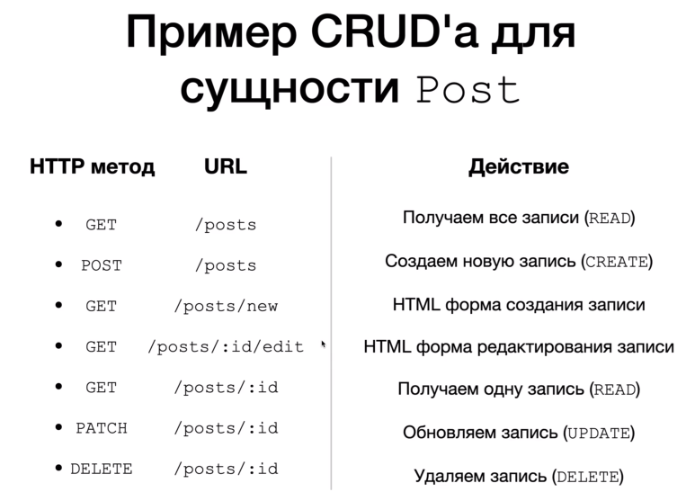

## CRUD, REST, Паттерн DAO (Data Access Object)

### Теория:

1. `CRUD`: добавлять **CREATE**, читать **READ**, обновлять **UPDATE**, удалять **DELETE** данные.
2. Чаще всего CRUD приложения являются Web-приложениями, доступ к БД предоставляется через протокол HTTP.
3. Почему именно такие URL и HTTP методы (как в Img, потому-что это часть правил REST паттерна проектирования
   web-приложений)
4. В DAO классах обычно пишется SQL код для работы с БД прилжоения (чтение, запись, обновление, удаление). В нашем случае мы покамесь будет работать со списком, обычно общаемся через БД, в дальнейшем мы перейдём на БД.
5. В Spring приложениях, обычно хорошим тоном считается разделять классы в разные пакеты: `config, controllers, models` 
   

### Приложение:

* Реализуем CRUD приложение для сущности Person, реализуем операцию READ
* Controller, метод `index()` получим всех людей
* Controller метод `show()` получим одного человека по id из DAO и передадим его на отображение представлению

### Объяснение:

* `@GetMapping("/{id}")` это означает что когда мы запустим приложение, можно будет в id указать любое число и это число
  поместиться в аргументы этого мтеода
* `@PathVariable` c его помощью в Controller мы извлечем id из url адресса и получим доступ к нему внутри метода.
* Теперь когда мы внедрили в наш Controller, `private final PersonDAO personDAO; + конструктор` мы теперь можем передавать его значения в модель для представления
